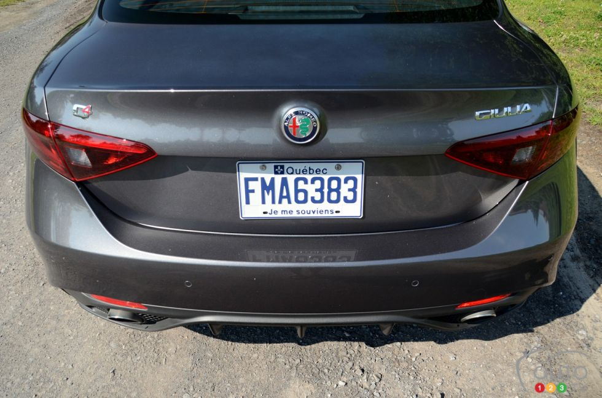
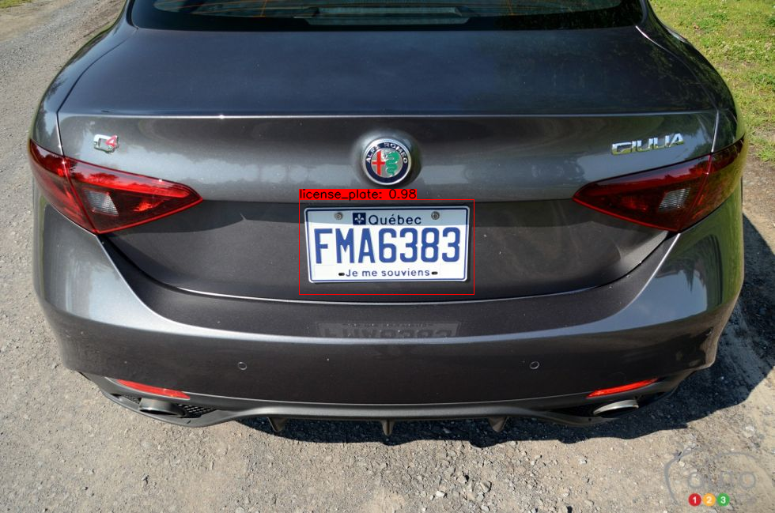
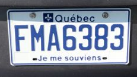
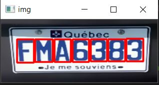
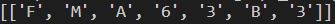

# Car_Number_Plate_Reader

## Introduction
In this project I have implemented a number plate recogniser which uses custom Yolov4 model to detect the number plates from cars.

The segmented number plate is then processed and single character of number plate is segmented which then is feeded into self trained model to recognise english alphabets and numerals and finally return a list containing each char of number plate.

## Required libraries

"libraries.txt" file contains the list of all neccessary modules required

## Setup
- Clone this github repo in any folder as you want.
- Download the custom yolo model weights using this [link]('https://drive.google.com/drive/folders/1CVjlp0tjS_jJ4CZnm5I6TKkCSjmJyo6h?usp=sharing')
- Save the downloaded weight to data folder of the repo.
- Then open the repo folder using VS code and run the following command in terminal.
```
    python save_model.py --weights ./data/custom.weights --output ./checkpoints/custom-416 --input_size 416 --model yolov4 
```
- Open the detect.py python code and them in the test funtion give the relative position of image you want to run the detector on.

## Results

### Original Image



### Number Plate Recognised




### Number Plate Segmented



### Segmented Characters



### Final Output




# Future Improvement Possible
- We can improve the final prediction result by using multiple models having small set of classes.
- We can use GAN to improve the quality of blurry images.
- For video feed one can use tensorflow lite such that the implementation would become real time.
- For contour detection one can also remove the contours formed withing the required contours.